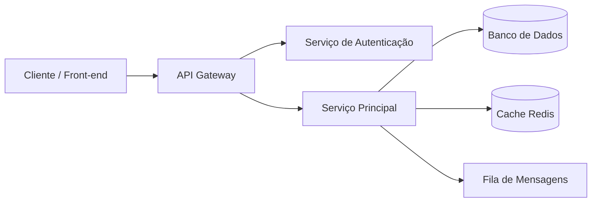

# Arquitetura do Projeto

## 1. Visão Geral

Descreva em alto nível como o sistema funciona, seu propósito e principais características arquiteturais (monolito, microsserviços, serverless, etc.).

## 2. Diagrama de Arquitetura

<!-- Insira um diagrama (imagem, Mermaid, draw.io) representando os componentes e o fluxo de dados -->

## 3. Componentes

| Componente        | Responsabilidade                          | Tecnologia        |
| ----------------- | ----------------------------------------- | ----------------- |
| Front-end         | Interface do usuário                      | React             |
| API Gateway       | Roteamento e autenticação das requisições | Node.js / Express |
| Serviço Principal | Regras de negócio                         | Node.js / Python  |
| Banco de Dados    | Persistência de dados                     | PostgreSQL        |
| Cache             | Armazenamento temporário para performance | Redis             |
| Fila de Mensagens | Processamento assíncrono                  | RabbitMQ / SQS    |

## 4. Fluxo de Dados

Descreva o caminho de uma requisição típica, do cliente até a resposta, passando pelos componentes envolvidos.

## 5. Decisões de Arquitetura (ADRs)

| ID      | Decisão                                 | Justificativa                          | Status       |
| ------- | --------------------------------------- | -------------------------------------- | ------------ |
| ADR-001 | Uso de PostgreSQL como banco principal  | Suporte robusto a transações ACID      | Aceito       |
| ADR-002 | Adoção de arquitetura de microsserviços | Escalabilidade independente de módulos | Em avaliação |

> Para decisões detalhadas, crie arquivos individuais em `docs/adr/NNN-titulo-da-decisao.md`.

## 6. Padrões de Projeto Utilizados

- Repository Pattern para acesso a dados
- Factory / Dependency Injection para desacoplamento
- Middleware para autenticação e logging

## 7. Requisitos Não Funcionais

| Categoria       | Requisito                                         |
| --------------- | ------------------------------------------------- |
| Performance     | Tempo de resposta médio < 300ms                   |
| Escalabilidade  | Suporte a X requisições simultâneas               |
| Disponibilidade | SLA de 99,9%                                      |
| Segurança       | Criptografia em trânsito (TLS) e em repouso       |
| Observabilidade | Logs estruturados, métricas e tracing distribuído |

## 8. Integrações Externas

| Serviço              | Finalidade                  | Protocolo  |
| -------------------- | --------------------------- | ---------- |
| Gateway de Pagamento | Processamento de pagamentos | REST/HTTPS |
| Serviço de E-mail    | Envio de notificações       | SMTP/API   |

## 9. Considerações Futuras

Liste limitações conhecidas e possíveis evoluções da arquitetura.
